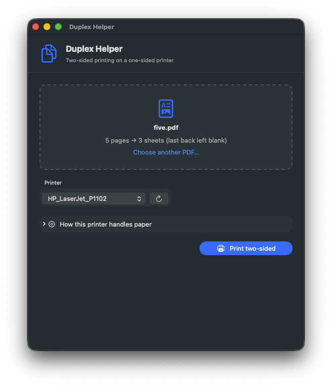
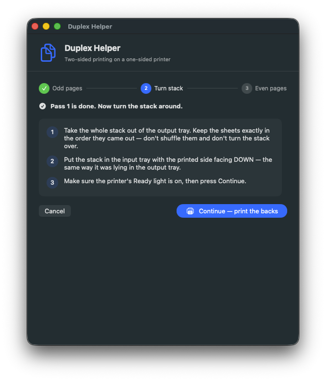
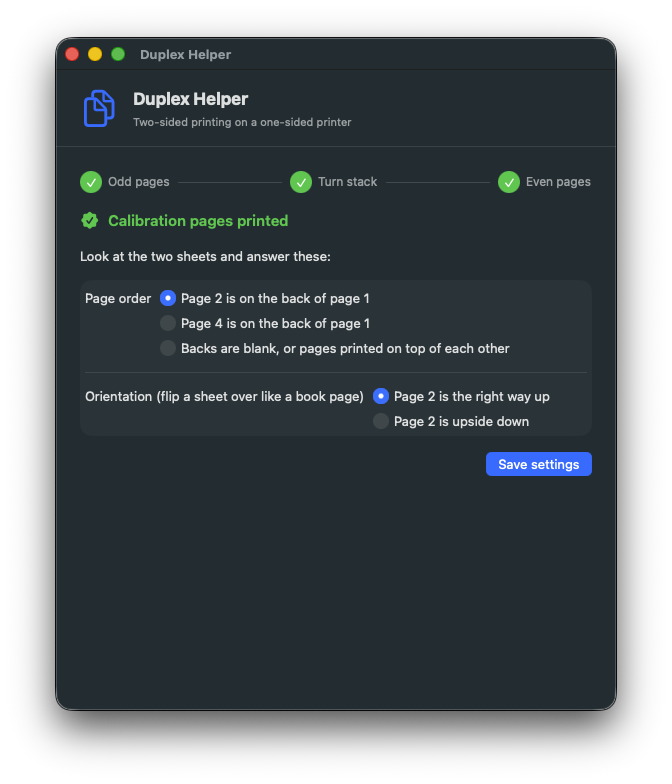

# Duplex Helper

A small native macOS app that prints two-sided on a printer with no duplexer —
such as the HP LaserJet P1102 this repo is about — by printing the odd pages,
walking you through turning the stack over, and then printing the even pages
onto the backs.

<p align="center">
  
  
</p>

It works with **any** CUPS queue, not just the P1102.

## Build

Needs only the Xcode command line tools (`xcode-select --install`), not Xcode.

```sh
cd duplex-helper
./build.sh --install     # builds a universal app and copies it to ~/Applications
```

Without `--install` the app is left in `duplex-helper/build/`.

The build is ad-hoc signed, so the first launch needs a right-click → Open (or
allow it in System Settings → Privacy & Security) because it is not notarised.

## Use

1. Drop a PDF on the window, or File → Open, or right-click a PDF in Finder →
   Open With → Duplex Helper.
2. Pick the printer. The P1102 queue is chosen automatically when present.
3. **Print two-sided.** Pass 1 prints the odd pages. When they are out, the app
   shows you exactly how to reinsert the stack for your printer. Press
   Continue and pass 2 prints the even pages on the backs.

Documents with an odd number of pages get a blank back on the last sheet,
automatically — the app pads the document so the sheets still pair up.

## Getting the reinsertion right

Every printer stacks and feeds paper a little differently. Three settings
describe it, under *How this printer handles paper*:

| Setting | Meaning | P1102 |
|---|---|---|
| Print even pages in reverse order | The last-printed sheet is on top of the stack and feeds first | on |
| Reinsert printed side up | The printer prints on the underside of the input stack | off |
| Rotate the stack 180° | Backs come out upside-down for book-style reading otherwise | off |

The defaults are right for the P1102 and most desktop laser printers. If you
are not sure, **Print calibration test** runs the full two-pass process on two
sheets with big page numbers, then asks two questions about what you see and
sets the three options for you.

<p align="center">
  
</p>

Settings are remembered per printer.

## How it works

The app does all the page work itself with PDFKit — it writes two temporary
PDFs (odd pages in order; even pages, reversed if configured, padded with a
blank) and hands them to `lp`. It then polls `lpstat` until each job leaves
the queue. Nothing depends on the driver honouring CUPS options such as
`page-set` or `outputorder`, so it behaves identically on every queue.

No shell is involved in running `lp`/`lpstat`: arguments are passed as arrays.

If you would rather not use an app, macOS can do the same thing by hand: in the
print dialog's *Paper Handling* section, print *Odd Only*, reinsert, then print
*Even Only* with *Reverse page order* ticked. Duplex Helper just removes the
guesswork and the two trips through the dialog.

## Development

```
Sources/main.swift              AppKit entry point
Sources/DuplexHelperApp.swift   app delegate: window, menu bar, Finder "Open With", --snapshot mode
Sources/ContentView.swift       the UI
Sources/Model.swift             state machine and per-printer settings
Sources/Printing.swift          PDF splitting, lp / lpstat wrappers
Tests/main.swift                checks the splitter against a real PDF
Resources/MakeIcon.swift        draws the app icon
```

Run the splitter check:

```sh
swiftc -swift-version 5 Sources/Printing.swift Tests/main.swift -o /tmp/splittest
/tmp/splittest some-five-page.pdf
```

Render every screen to PNGs without a printer (used for the images above):

```sh
"build/Duplex Helper.app/Contents/MacOS/Duplex Helper" --snapshot docs some.pdf
```
